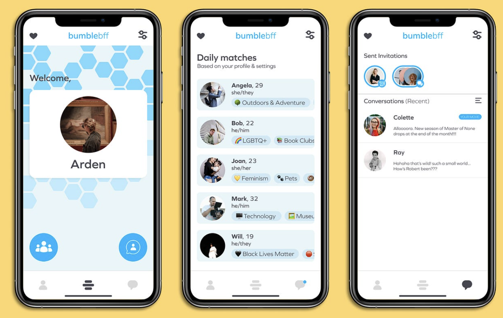
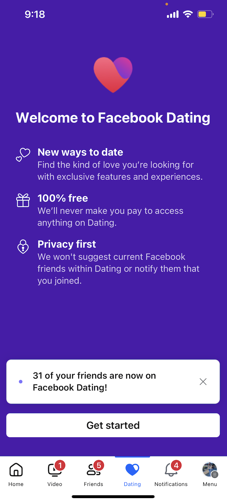
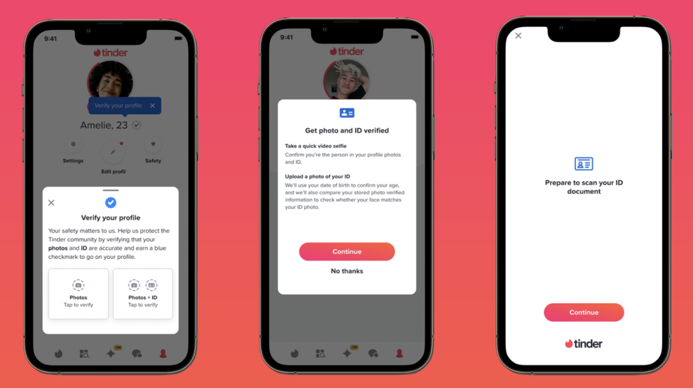
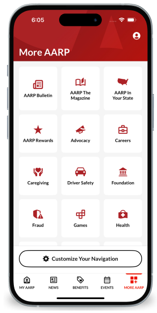
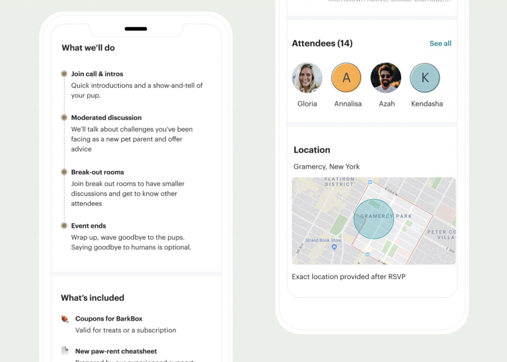
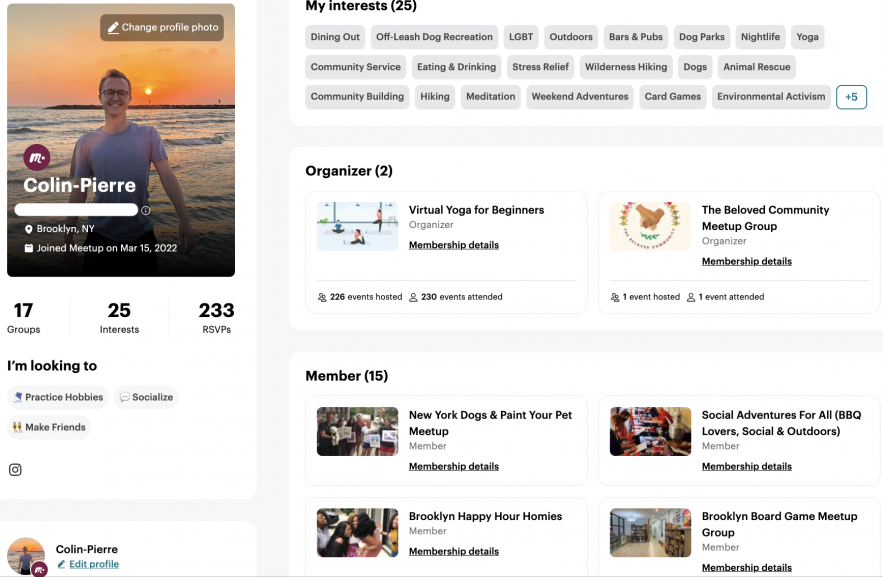
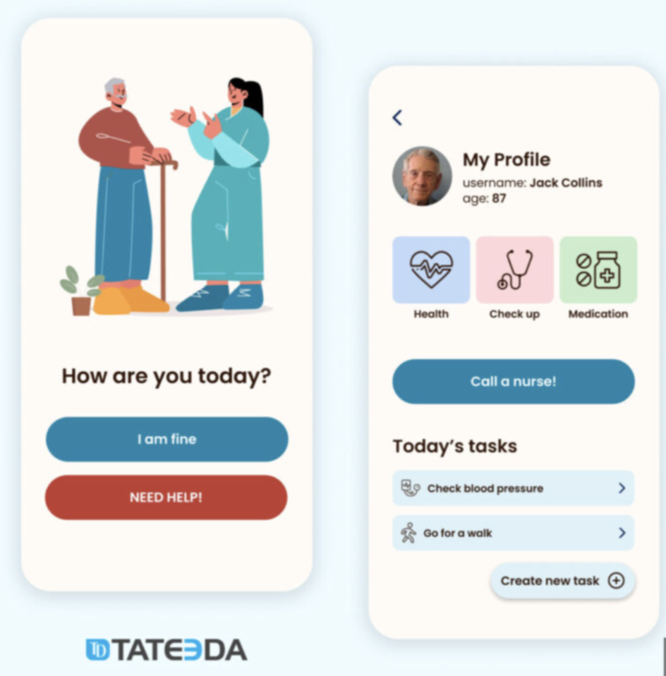
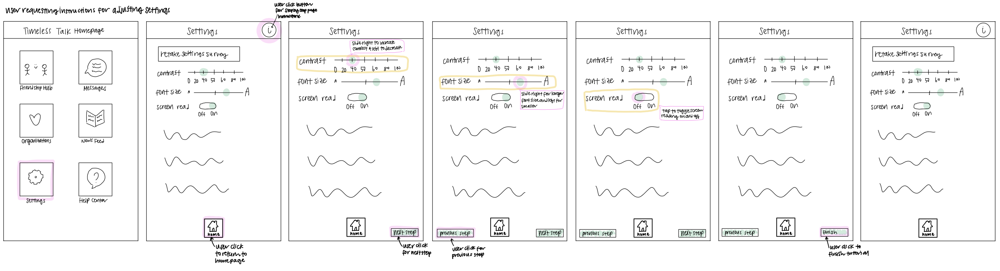
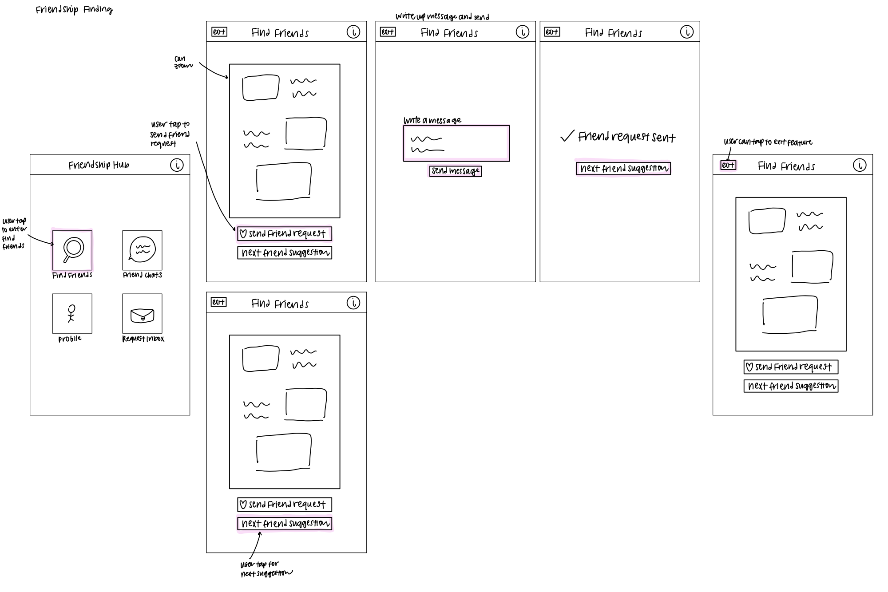

# 1. APPLICATION GOALS

## APP NAME: TimelessTalk

Timeless: Representing that the main drive for this app creation is to prioritize the needs of the elderly in a social app. 

Talk: 
The talk aspect encompasses the app's coverage of chatting, news, and friend-making features.

## AUDIENCE

1. Elders: 
Elders will be able to use this social media app as an accessible "one stop shop" for their socializing and information gathering needs.

2. Elders' close circle:
Family, friends, neighbors, and other elders can sign up for an account on the app to communicate and interact. 

3. Organizations
Groups that organize activites or provide services for elders in different niches.

## USER VALUE 
Existing social media apps contain some subset of chatting, information gathering, and friendship making features. This app differentiates itself is tailoring it's design towards best assisting elders in staying connected. This app will contain features that are specially tailored towards being accessible for elders while also creating a singular comprehensive space for the elderly socialize and interact.  

##
# 2. COMPARABLES

## Bumble BFF structuring/features
Bumble BFF feature with pages with clean and simple pages containing daily matches as well as conversations logs. Consider including these different pages to be included in the friend making feature.
{:width='400'}

## Facebook Dating opt-in
Facebook App contains a tab for Facebook Dating that starts off with an 'opt in' feature that users can select to kickstart the feature. This can be an option for the friendship hub, organization activity joining, as well as news!
{:width='180'}

## Tinder identification 
Tinder requires government ID to be included in order for profile to be verified/created. This step can be required at the beginning of the app registration to differentiate elder users with other users.
{:width='400'}

## AARP interface
AARP's overall interface has very simple layout with icons along with simple labels that are easily understandable for its more elderly audience. Could be good to take inspiration from this for simple yet understandable pages.
{:width='200'}

## Meetup event page layout/interest tags
Meetup contains detailed yet concise information about events as well as location details about events. Including a simple yet descriptive page helps to make the events understandable. 
{:width='400'}

Meetup also allows interest tags to be selected by user for types of activities. Plan to take inspiration and allow users to prioritize seeing specific activity. Potentially can also consider including preferred organizations as well as locations. 
{:width='400'}

## Tateeda layout
Tateeda an aged care app includes clear sentences and easy to understand and obvious options to select. The goal is to ensure each page of the app is easy to understand and navigate.
{:width='300'}

## Wechat chat features
Wechat chatting/chat creation features are easy to understand and perform. Having all offered features on a singular dropdown is helpful to prevent getting lost in nooks and crannies of an app. 
{:width='200'} 
{:width='200'}

##
# 3. FEATURES
## 3.A Identity features:
1. Age registration: An age range upon sign up for user to specify their age for use of certain app features.

2. Identity verification: An identity verification feature to ensure that identity claims are valid.

3. User pooling: Using info gathered from age registration and government id, users are "sorted" into corresponding groups (eg. elderly, non-elderly). 

## 3.B Elderly friendship hub: 
4. Opt-in feature: A feature "elderly" user can sign up for that allows elderly to make friends online or nearby in proximity.

5. Profile customization: Qualified users can fill out fields of their profile with location, age expectations, hobbies, interests, and photos to be displayed to others.

6. Friendship matching feature: Users can create simple profiles and swipe to show interest in pursuing a potential friendship.

7. Location of interest: Preferred location is collected upon opting into the elderly friendship hub to help elderly find nearby friends and taken friendship from online to offline.

8. Gender preferences: Users can select preferences for friendship gender.

## 3.C News/information feed:
9. Niche personalization: Allowing user to select and personalize the niche's of news and publications that they receive.

10. Source pre-filtering: Giving users the option to select/deselect sources that they would/would not like to receive content from.

11. Summarization option: Option to click a "content summarization" button for a brief and summarative description of the papers/articles that are being presented.

## 3.D Accessibility features:
12. Repeated instructions: Allowing user to toggle the option of repeated concise tutorials/guides in different languages for use of app pages.

13. Help Center: Including an FAQ sections as well as contacts for more help on issues. Potentially adding a question mark button on most if not all pages that easily directs to quick FAQs of specific functionalities.

14. Display features: Larger font options, text reading, high contrast mode, colors.

15. Icon + text display: Maximize opportunities to use easily understandable icons + short lines of text to depict in-app selections. 

## 3.E Organization participation: 
16. Opt-in/location based feature: A feature "elderly" user can sign up for that allows elderly to find organization led events online or nearby in proximity.

17. Niche selection: Elderly can select specific niches, organizations, or activities they are interested in.

18. Personalized event recommendations: Based off of user information and interactions, recommend specific organization events.

## 3.F Direct and group messaging:
19. Direct messaging: Two users can send texts, images, and vidoes.

20. Group chats and 1-on-1 chats support voice and video call. 

##
# 4. VSD ANALYSIS

## 4.1 Stakeholders: 
### Observation: 
It is important that this app focuses on serving it's target stakeholders, the elders. While focusing on this, it is important for those close with elders to feel that using this apps is beneficial and helpful and be able to reflect their opinions.

### Design response:
We can potentially include a feedback tab for users to document their user experience both for elders and their close ones, so we can better understand if we're satisfying the communication needs of all parties while allowing the elderly to use social media more independently and smoothly.

## 4.2 Stakeholders:
### Observation:

This app is targeted towards the elderly, and oftentime they may require extra accessibility accomodations, yet may feel overwhelmed if they need to deal with toggling too many settings upon setup. 

### Design response:
To further help elders find ease in using this app, we could conduct a concise and comprehensive survey upon signing up for the app that includes a series of questions tailored towards certain setting options. The responses to this survey can then be used to create a preset for items such as font size, colors, instruction repetition. 

## 4.3 Pervasiveness:
### Observation:
Current features that are only open to elderly include the friendship hub and organization participation. Other than chat features and potentially news, there aren't that many features for those close to the elderly.

### Design response:
In order to potentially increase the incentive for using the app, as well as feeling involved with the app perhaps some organization participation can be opened to non-elders for volunteering/larger community.

## 4.4 Values
### Observation:
It is important for the elders to not feel overwhelmed with each page of the app or the amount and types of information they are receiving. 

### Design Response:
To combat this, it could be good allow the users to select tags and filter in all the areas of news, friendship hub, and organization participation. Potentially, I can also include a support feature to allow users to set a limit the amount of swipes allowed per day, articles to read, organization event visible on a page to allow more autonomy for information reception. 

## 4.5 Time
### Observation: 
Overtime the elderly may find that they do not want to participate in certain features for a period of time or their accessibility needs for the app change.

### Design Response:
It could be helpful to include a reset settings button/retake questionaire for the accessibility settings to be reset/readjusted. Also, I could consider including the option of temporarily pausing friendship hub accounts and allowing deletion of registered accounts completely. 

##
# 5. STORYBOARDING/SKETCHING
## User requesting additional instruction for adjusting settings
{:width='1000'}

Future decisions:
1. Other settings to include.
2. Format of return to homepage button/function.
3. Incorporate instructions in a noncluttered way.

## Finding friends on Friendship Hub
{:width='1000'}

Future decisions:
1. Refine how friendship profiles are formatted and displayed.
2. Refine request message writing and decide whether to solely write a message or respond to a certain part of profile.

