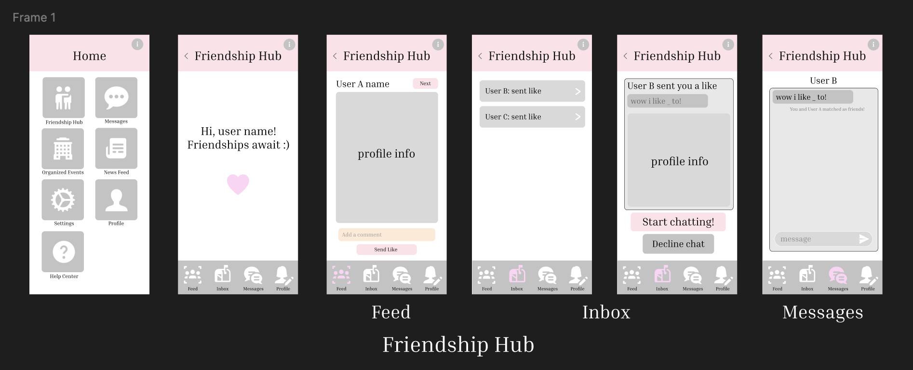
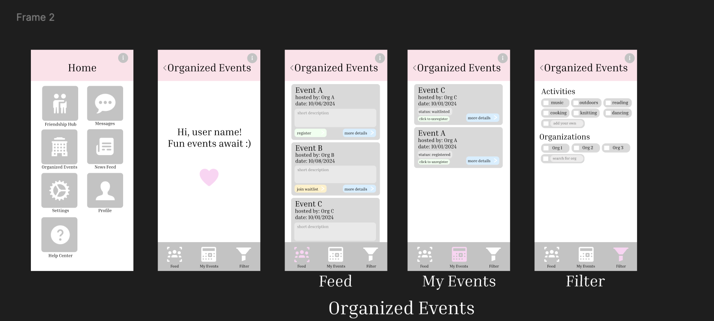
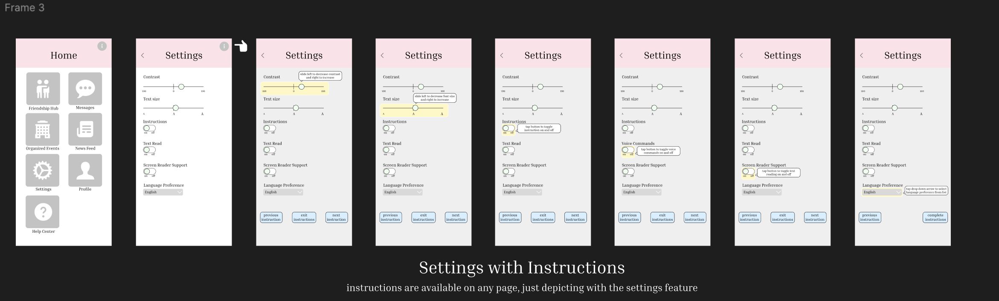
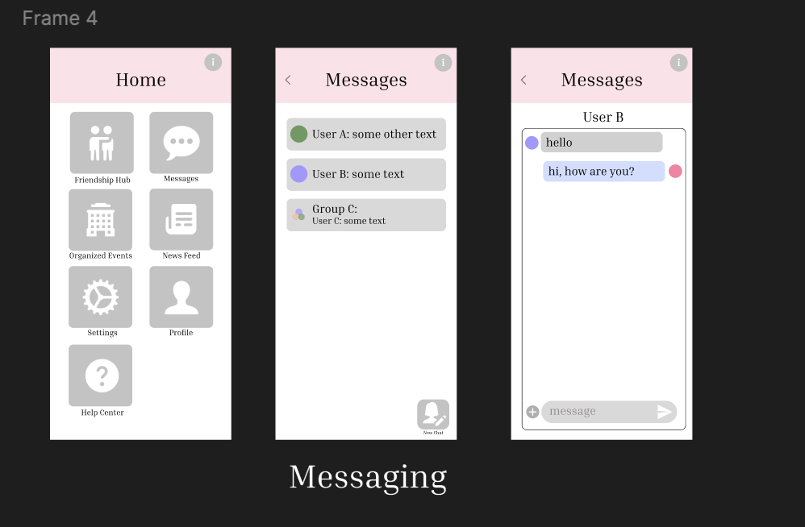

# 1. PITCH
Introducing TimelessTalk, a groundbreaking social app designed just for seniors, fostering connection, conversation, and community. Our mission is to create a welcoming digital space where older adults can engage with their peers, stay connected with loved ones, and build lasting friendships—all while prioritizing accessibility and ease of use.

### Target Audience: 
TimelessTalk is perfect for older adults looking to enrich their social lives, as well as their family members, friends, and organizations dedicated to supporting seniors. We understand that staying connected is vital for mental well-being, and our app serves as a "one-stop shop" for social interaction.

### Value Proposition: 
TimelessTalk is thoughtfully designed with seniors in mind. Our user-friendly interface and specialized features ensure that elders can navigate the app effortlessly. Key functionalities include:

#### Elderly Friendship Hub: 
A unique feature allowing users to create profiles, swipe for potential friendships, and connect with nearby peers based on shared interests.

#### Personalized Organization Events: 
Customize event feeds according to individual preferences, filtering activities from various organizations to match users' interests.

#### Accessibility Options: 
Features like larger fonts, high-contrast modes, language selection, text reading,and easy-to-follow/possibility repeated tutorials create a comfortable and stress free user experience.

#### Direct and Group Messaging: 
Effortless communication with family, friends, and loved ones through texts, images, voice, and video calls in messaging fosters deeper connections and support to help the elderly feel connected.

##
# 2. FUNCTIONAL DESIGN

## 2.0 Main Features
Elderly Friendship Hub, Personalized Organization Events, Accessibility Features, Direct & Group Messaging

##### Additional Features (helpful but may have time constraint):
News Feed

## 2.1 CONCEPTS
Concepts currently address and explore functionalities of the main features.

## User:

### Purpose: 
Provide authentication for users, ensuring secure access to their accounts.

#### Operational principle: 
After a user (person or org) registers with a phone number and password valid ID, they can then person_login or org_login by entering the associated username and password

### Actions:
#### user_register(name: String, number: Integer, password: String, id: user_ID, out user: User): 
Returns a user that has valid name, phone number, password, ID just registered.

#### user_login(number: Integer, password: String, out user: User): 
Returns a registered user that correctly corresponds with the number and password provided.

### State
users: set User

user_number: User -> one Integer

user_password: User -> one String

user_id: User -> one user_ID


## Org
### Purpose: 
Provide authentication for organizations, ensuring secure access to their accounts.

### Operational principle: 
After a organization registers with an email, password, and valid organization ID, they can then org_login by entering the associated username and password.

### Actions: 
#### org_register(name: String, email: String, password: String, id: org_ID, out org: Org)
Returns a user that has valid name, phone number, password, ID just registered.

#### org_login(email: String, password: String, id: ID, out org: Org): 
Returns a registered organization that correctly corresponds with the number and password provided.

### State:
orgs: set Org

org_email: Org -> one String

org_password: Org -> one String

org_id: Org -> one org_ID 


## Profile 

### Purpose: 
Storing and visually providng a user's information.

### Principle: 
When a user/organization registers, they are prompted to create_profile. This profile can then be edited and changed by update_profile. If the user decides to delete_profile, the profile will be deleted.

### Actions:
#### create_profile(user: User, out profile: Profile)
The new user creates a profile.

#### update_profile(user: User, change: Item, out profile: Profile)
User updates given item of profile.

#### delete_profile(u: User) 
User deletes profile and profile is removed from app database.

### State:
profile: User -> one Profile

profile: Org -> one Profile 

full_name: Profile -> one String

phone_number/email: Profile -> one String

date_joined: Profile -> one int

identification: Profile -> one String

location: Profile -> set Float

user_type: Profile -> "elderly" or "non-elderly" or "organization"

## Instructions
### Purpose: 
Provides option for step by step instructions on any page that guides users through how to navigate through each page. Helps to decrease the sense of feeling overwhelmed or confused when navigating app.

### Operational principle: 
After toggling next_instruct and prev_instruct for guidance through the instructions, the user can either choose to exit_instruct at any time or complete_instruct at the end of the instructions for the page. This will take the user back to the current page without any instructions. 

### Actions: 
#### start_instruct (page: Page)
User can be guided through a series of instruction on how to navigate the page.
#### next_instruct (page: Page, cur: Instruction, out next: Instruction)
Starts with the current instruction and moves on to the next instruction of the given page if a next instruction exists
#### prev_instruct (page: Page, cur: Instruction, out prev: Instruction)
Starts with the current instruction and moves to the previous instruction of the given page if a previous instruction exists. 
#### exit_instruct (page: Page)
Exits the instruction state and takes user back to page without instructions.
#### complete_instruct (page: Page)
Exits the instruction state with a quick pop up message and takes user back to page without instructions.

### State: 
cur_instruct: Page -> one Instruction

ordered_instruct: Page -> list Instruction

text: Instruction -> one String

## EventFiltering
### Purpose: 
Enables users to select and filter the organizations and types of events they receive in their Organization Events feed. 

### Operational principle:
Users can choose to reset_preferences whenever to allow all events to show up on their feed. They can also add_preferences or remove_preference through toggling a series of tags to determine the events they receive. Once their preferences are determined, users can filter_events to display an updated series of events matching their preferences on their feed.

### Actions:
#### reset_preferences()
Reseting user preferences for filtering events.
#### add_preference(user: User, preference: Preference)
Adding a preference for filtering the types of events shown on page.
#### remove_preference(user: User, preference: Preference)
Removing a preference for filtering the types of events shown on page.
#### filter_events(user: User, preferences: list Preference, events: list Event)
Filter events to follow preferences and display events on feed.

### State:
cur_preferences: User -> list Preference

label: Preference -> one String

toggled: Preference -> one Boolean

cur_events: User -> list Event


## OrgEvent
### Purpose: 
Organization and group can post events for users to sign up for and participate in.

### Operational principle: 
Organizations are able to add_event or remove_event to have events show up are user feeds. They can also choose to toggle or present signup_open to determine when events are set to open for registration. 

### Actions:
#### add_event(org: Org, event: Event)
An event is created by an organization and added to the events database. 
#### signup_open(event: Event)
An event is opened for users to register/waitlist themselves for or closed.
#### remove_event(event: Event)
An event is removed by an organization and removed from the events database. This event will be removed from the events displayed all users feeds. 

### State:
all_events: Feed -> list Event

open_events: Feed -> list Event

org_events: Org -> list Event

event_open: Event -> one Boolean

event_date: Event -> one String

event_spots: Event -> one Integer

event_signups: Event -> one Integer

event_desc: Event -> one String


## EventSignup
### Purpose: 
Users can scroll through event feed and sign up/waitlist themselves for event as well as update their registration status for events.

### Operational principle: 
Users are able to reserve_spot or join_waitlist for any event they see on their feed depending on the availability of the event. They are also able to remove_res at any time to cancel their spot for the event.

### Actions:
#### make_res(user: User, event: Event)
User reserves a spot for an event posted.
#### join_waitlist(user: User, event: Event)
User joins waitlist spot for an event posted.
#### remove_res(user: User, event: Event)
Removes user's current spot on event posting and removes event from user's events.

### State:
all_events: Feed -> list Event

reserved_events: User -> list Event

waitlisted_events: User -> list Event

event_reservations: Event -> list User

event_waitlists: Event -> list User

## FriendshipRequest
### Purpose: 
Users can send a like or message as a form of a friend request to any user that shows up on their feed.

### Operational principle: 
Users are able to send_like or send_message with some content to a user that they see on their feed. They can also choose to select the next_user button to skip over the current user whose profile they are viewing.

### Actions:
#### send_like(from: User, to: User)
A user can send a like to another user. 

#### send_message(from: User, to: User, message: String)
A user can send a message with content to another user. 

#### next_user(cur: User, out next: User)
A user can skip over the current user whose profile they are currently viewing. 

### States:
current_receiver: Feed ->  one User

all_receivers: Feed -> list User

like_from: Like -> one User

like_to: Like -> one User

message_from: Message -> one User

message_to: Message -> one User

## FriendshipInbox
### Purpose:
Users can send a like or message as a form of a friend request to any user that shows up on their feed.

### Operational principle: 
Users are able to accept_request or reject_request for all the requests showing up in their inbox. New request will be added through add_request. Once a conversation has been going on/users decide to become closer friends, they can choose to transfer_messages from Friendship Hub to Timeless Talk Direct Messages.

### Actions:
#### add_request(from: User, to: User, request: Request)
Friend request from one User to another gets added to the Friendship Hub request inbox
#### accept_request(from: User, to: User, request: Request)
Accepting the like/message request from another User and taken to a chat within Friendship Hub.
#### reject_request(from: User, to: User, request: Request)
Reject the like/message request from another User.
#### transfer_messages(user1: User, user2: User)
Transfer a message conversation from Friendship Hub to Timeless Talk Direct Messages

### States:
all_requesters: Feed -> list User

all_requests: Feed -> list Request

current_requester: Feed ->  one User

current_acceptor: Feed -> one User

accepted: User -> list User

accept_from: Accept -> one User

accept_to: Accept -> one User

reject_from: Reject -> one User

reject_to: Reject -> one User

## Settings (listing a few)
### Purpose:
Settings where users can toggle settings to better accomodate their in app needs.

### Operational principle: 
User can adjust_contrast, adjust_text on a scale to increase or decrease these settings. User can toggle instructions_on and text_read to turn fucnctions on or off. Users can reset all settings to default through reset_settings.

### Actions:
#### adjust_contrast(contrast: Contrast)
Adjusting on a scale of how much contrast there is in the app.
#### instructions_on(on: Boolean)
Toggling whether to turn constant instructions on or off.
#### adjust_text(size: Size)
Adjusting on a scale how large the text size is in the app. 
#### text_read(on: Boolean)
Toggling whether to turn text reading on or off.
#### select_language(language: String)
Selecting language to be displayed
#### reset_settings(settings: list Setting)
Reset all settings to default.

### States:
user_settings: User -> one Settings

contrast: Settings -> one Contrast

instruction: Settings -> one Boolean

text_size: Settings -> one Size

text_read: Settings -> one Boolean

language: Settings -> one String


## 2.2 CONCEPT SYNCS
### 2.2.a
Syncing when a like/message is sent from a user, the like/message request shows up in the inbox of the receiving user. 

```
sync addLikeInbox(from: User, to: User):
	when FriendshipRequest.send_like(from, to):
		FriendshipInbox.add_request(from, to) //add from like request to the to inbox
```
```
sync addMessageInbox(from: User, to: User, message: String):
	when FriendshipRequest.send_message(from, to, String):
		FriendshipInbox.add_request(from, to) //add from message request & contents to inbox.
```
	
### 2.2.b
Syncing when an event is removed from Organization Events, the reservation/waitlist events of a user are updated and the events are refiltered according to user preferences.

```
sync eventRemoval(event: Event):
	when OrgEvent.remove_event(event):
        //loop through all users in event and update for all users.
		EventSignUp.remove_res(user, event) 
		EventFiltering.filter_events(user, user_preferences: list Preference, events: list Event)
```

### 2.2.c
Syncing when an event is added to Organizaion Events, the events are refiltered according to user preferences.

```
sync eventAddition(event: Event, events: list Event):
	when OrgEvent.add_event(event):
        //loop through all users in event and update for all users
		EventFiltering.filter_events(user, user_preferences: list Preference, events: list Event)
```

### 2.2.d
Syncing when in settings, the instructions_on setting is turned on, the instructions will begin starting once we exit settings and reach the home page. Even when instructions_on setting is turned off, when the instructions button is pressed on any page, this will be synced to Instructions.start_instruct for that page.

```
sync instructionsOn():
    when Settings.instructions_on(on=true):
        Instructions.start_instruct(page=home_page)
```

# 3. WIREFRAMING
{:width='900'}

{:width='650'}

{:width='1000'}

{:width='400'}

Figma link: https://www.figma.com/design/38AVlZriKctYQFl3bY8zs8/Untitled?node-id=0-1&m=dev&t=7YBd3HLAgxCaXDIM-1

# 4. DESIGN TRADEOFFS

## Design Tradeoff: Visual Display

### Options
#### Visual Simplicity: 
Ensure that there is a minimalistic design with a simple, neutral palette and a clean layout. Maintain a consistent design throughout all pages to help users become familiar with the app.

#### Ease of Understanding: 
Include easily recognizable icons as well as concise yet meaningful text that makes navigating each page clear and understandable. Use different, more vibrant colors to quickly identify and differentiate between buttons and functions to avoid confusion.

### Rationale
A design that prioritizes ease of understanding was chosen to help users, especially the elderly, better recognize and understand the different features and functionalities of the app. The app has many features, so although it is important for pages to be relatively simple, this cannot be guaranteed. Therefore, for features such as the Friendship Hub or News Feed, I have prioritized helping users easily understand what the functionalities on each page are and where they are located. This can aid users in being able to more independently reach their end goal on the app.

## Design Tradeoff: News Feed Feature

### Issues with feature inclusion
#### Time constraint: 
With two of the larger features—Friendship Hub and Organization Event—at play, implementing a third relatively complex feature would be difficult given the four-week time constraint.

#### Licensing/regulations: 
Grabbing news from outside sources requires certain agreements or licensing that may be extensive or complex. 

#### Scalability:
Managing the storage news content especially if rich media such as videos or high-res images could be difficult to deal with.


### Options
#### Part of expansion feature in the future:
Maintain the app primarily as a socializing and connection tool, and include the news feature in the future when adding the more information-based aspect of social media.

#### Direct user to sites or links:
Instead of actually having news in the app, offer links with short descriptions of the articles to take the user out of the app.


### Rationale
Prioritizing the main features upon the initial rollout of the app would help provide a social experience that is helpful and beneficial for elders. Once users feel that they would like to spend more time on this app and are accustomed to the existing features, the news feed feature can be launched slightly later. The complexities of navigating information licensing or including pop-out tabs and links in the existing interface could be overwhelming for the user and technically challenging to implement within the current timeframe.

## Design Tradeoff: Types of Users
### Options
#### Non-elderly, elderly
Originally, I planned to do just user sign-ups, where users would be divided into non-elderly and elderly subgroups. Through their identification, they would have profiles with features allotted to their specific groups: the elderly would have access to all features, while the non-elderly would have access to direct messaging and group messaging. Organizations would contact the app creators/managers and have their events posted by individuals on the backend.

#### Non-elderly, elderly, organizations
With organizations added, there would be the option of registering as a user or an organization. With this differentiation, the steps of signing up and validation are different, as described in the User and Org concepts. Users will see certain features of the app, and organizations will be able to add their events to the organization events tab for users to sign up for.

### Rationale
I decided to include non-elderly, elderly, and organizations as the groups that can create accounts on the app. Although both options would require approval from the app creators for events submitted by organizations, including organizations as part of the sign-up process (1) allows organizers to keep track of their event sign-ups through the app. This also (2) eliminates the extra step of the app backend having to convert an event to a valid format for display:

Option 1: Organization submits events through email/form → App backend processes event validity → App backend converts event to valid format for app → Event appears in app.

Option 2: Organization submits events through app → App backend processes event validity → Event appears in app.