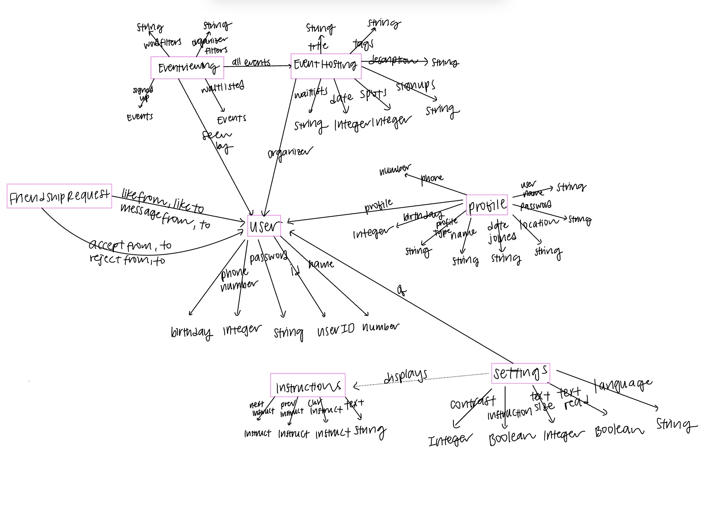

# DATA MODELING

### Concept: Authenticating/User
### State:
id: one UserID

username: one String

name: one String

password: one String

number (phone number): one Integer

age: one Integer

### Concept: Profile [Authenticating.User]
### State:
id: one ProfileID

userid: one UserID

username: one String

password: one String

name: one String

phone: one Integer

age: one Integer

city: one String

state: one String

language: one String

signedup: one Array String

waitlisted: one Array String

filters: one Array String

### Concept: Instructions 
### State: 
previous: one Instruction | None

current: one Instruction

next: one Instruction | None

text: one String

### Concept: EventHosting [Authenticating.User]
### State:
id: one EventID 

organizer: one User

title: one String

description: Event -> one String

date: one Integer

spots: one Integer

signups: Array String

waitlists: Array String 

tags: String

### Concept: Friendship [Authenticating.User]
### State:

user1: one UserID

user2: one UserID

### Concept: FriendshipRequest [Authenticating.User]
### State:

from: one UserID

to: one UserID

status: "pending" | "rejected" | "accepted"

message: one String

### Concept: FriendshipMessage [Authenticating.User]
### State:

from: one UserID

to: one UserID

content: one String

### Concept: FriendProfile [Authenticating.User]
### State:

userid: one UserID

bio: one String

genderPronouns: one String

interests: one Array String

age: one Integer

### Concept: Settings [Authenticating.User]
### State:
settings: User -> one Settings

contrast: one Integer

instruction: one Boolean

text_size: one Integer

text_read: one Boolean

### Diagram:
{:width='900'}

## IMPLEMENTED CONCEPTS:

#### Authenticating, Profiling, EventHosting, Friending, Sessioning, Setting

## DEPLOYMENT:
Vercel: https://assignment4-xi-liard.vercel.app/

## DESIGN REFLECTION

As I worked on the backend, I had several realizations that led me to refine my original design concepts. One major challenge I faced, was figuring out which concepts were truly necessary to keep independent and which ones to merge especially when they pertained to the same feature. I spent a lot of time looking at authenticating class, which ended up covering a lot of the functionality I initially thought would belong to both user and profile management. Ultimately, I decided to focus authenticating specifically on user creation, login, and logout, while letting the profile serve as a place for users to track their stats in real time and update personal information.

I also realized that the organizations account concept wasn’t as essential as I thought. After some research, I realized that organizations rarely sign up just to host a few events on an app. It made more sense for individual users to create accounts and propose events themselves, aligning better with how people typically use apps like this.

Separating event viewing from event hosting was another important decision. Hosting events is more of a behind the scenes role that involves logistics, while event viewing is more about user enjoyment and participation. By keeping these roles distinct, I could better cater to the different experiences users are looking for.

I also decided to remove the Direct Messaging feature for now since it exists in many different apps, and I don't think it's as worth the time to develop compared to the other features.

One more thought I had was about the instructions. I found that these actions don’t need to be recorded outside of the current session. This made me rethink how I represent these elements in my diagrams, ensuring clarity about their static nature.