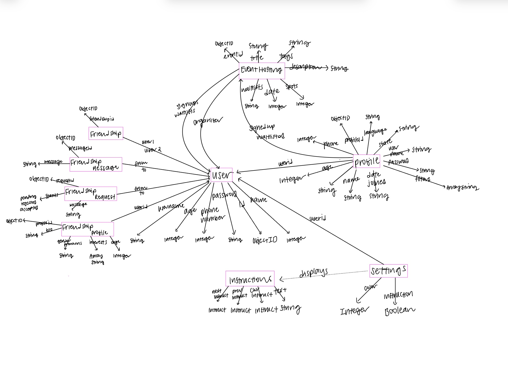

# DATA MODELING

### Concept: Authenticating/User
### State:
id: one UserID

username: one String

name: one String

password: one String

number (phone number): one Integer

age: one Integer

### Concept: Profile [Authenticating.User]
### State:
id: one ProfileID

userid: one UserID

username: one String

password: one String

name: one String

phone: one Integer

age: one Integer

city: one String

state: one String

language: one String

signedup: one Array String

waitlisted: one Array String

filters: one Array String

### Concept: Instructions 
### State: 
previous: one Instruction | None

current: one Instruction

next: one Instruction | None

text: one String

### Concept: EventHosting [Authenticating.User]
### State:
id: one EventID 

organizer: one User

title: one String

description: Event -> one String

date: one Integer

spots: one Integer

signups: Array String

waitlists: Array String 

tags: String

### Concept: Friendship [Authenticating.User]
### State:

user1: one UserID

user2: one UserID

### Concept: FriendshipRequest [Authenticating.User]
### State:

from: one UserID

to: one UserID

status: "pending" | "rejected" | "accepted"

message: one String

### Concept: FriendshipMessage [Authenticating.User]
### State:

from: one UserID

to: one UserID

content: one String

### Concept: FriendProfile [Authenticating.User, EventHosting.Event]
### State:

userid: one UserID

bio: one String

genderPronouns: one String

interests: one Array String

age: one Integer

### Concept: Settings [Authenticating.User]
### State:
settingid: one SettingID

instruction: one Boolean

color: one Integer

### Diagram:
{:width='900'}

## IMPLEMENTED CONCEPTS:

#### Authenticating, Profiling, EventHosting, Friendship, FriendRequest, FriendshipMessage, FriendshipProfile, Sessioning, Setting

## DEPLOYMENT:
Vercel Deployment: https://assignment4-xi-liard.vercel.app/

Backend Code: https://github.com/clairejc/assignment4 

## DESIGN REFLECTION

While working on the backend, I had several realizations that prompted me to refine my original design concepts. One major challenge was determining which concepts needed to remain independent and which could be merged, especially when they related to the same feature. I spent considerable time analyzing the authentication class, which ultimately encompassed much of the functionality I initially thought would be divided between user and profile management. I decided to focus authentication specifically on user creation, login, and logout, while the profile would serve as a space for users to track their stats in real-time and update personal information.
I also came to realize that the organization account concept wasn’t as crucial as I initially thought. After some research, it became clear that organizations rarely sign up just to host a few events on an app. It made more sense for individual users to create accounts and propose events themselves, aligning better with how people typically use apps like this.
I debated the modularity of the events concept while working on the alpha and beta versions of the assignment. Ultimately, I decided to keep events as a singular concept, as the individual components felt too small on their own and could benefit from combined functionalities.
I also chose to remove the Direct Messaging feature for now since it’s common in many apps, and I believe it’s not worth the development time compared to other features. Instead, I added support for direct messaging within the friending feature.
The friending feature was split into multiple concepts due to the various aspects of the Friendship Hub, including messaging, sending requests, and creating a friendship profile. Combining all these elements into one concept could make it overly complex.
Lastly, I looked into how to handle instructions and found that these actions don’t need to be recorded outside of the current session, which made me realize that it is mostly a frontend task. This made me to rethink how I represent the instruction elements in my diagrams to ensure clarity about their static nature.

Utilized ChatGPT to help with the wording of my design reflection. 