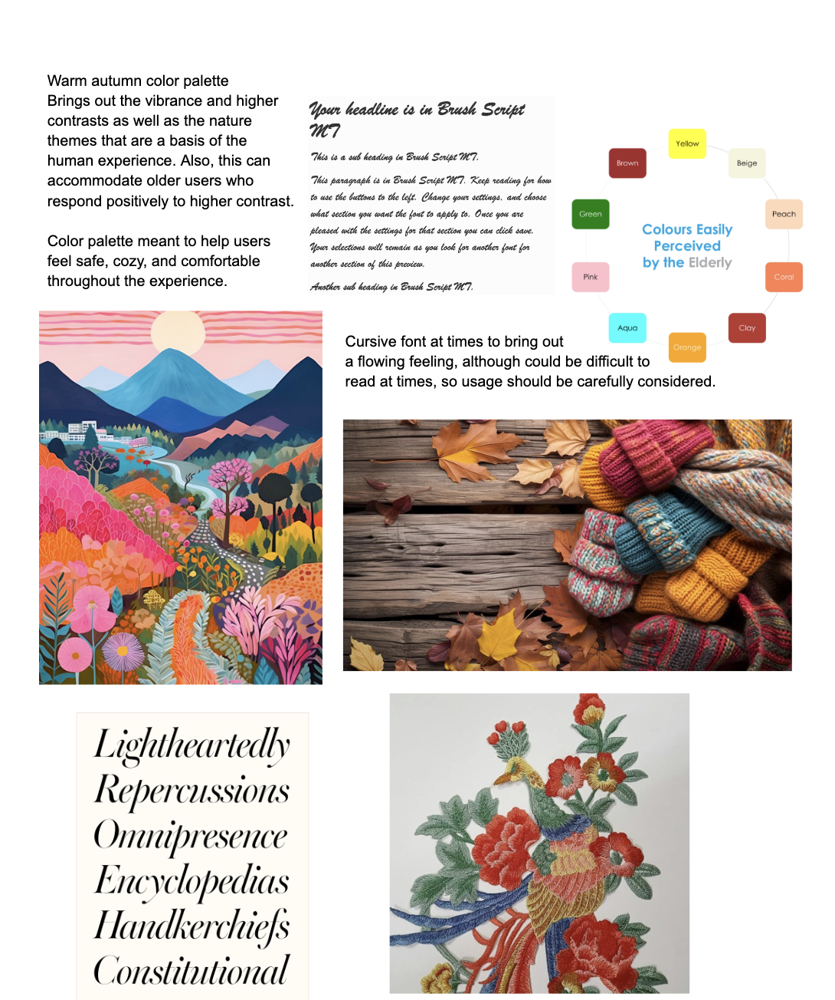
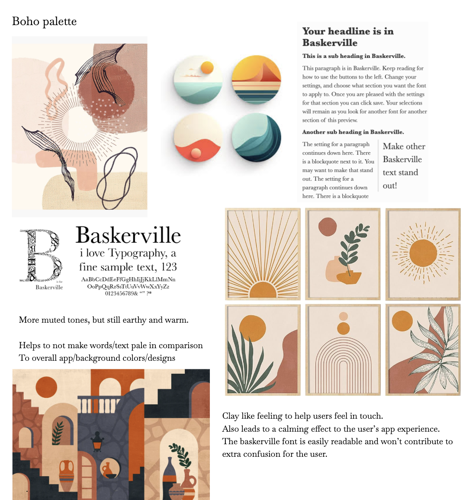

# HEURISTIC EVALUATION

## Usability Criteria:
### Discoverability:
- Home page contains very obvious and easily understandable icons that contain a text title under them which should aid users in quickly understanding what features exist upon landing in the app. 
- Instructions button at the top of every page/feature allows users to click on the button is they are confused or tentative about how to navigate a page.
- Therefore, a user should be able to easily operate the interface and get aid if they find it difficult. 
- Repetitive instructions and visible icons should help a user adapt to the app.

### Accessibility: 
- Settings contains text size, instructions, text read, language preference.
- These features are put in place in order to better accommodate people with disabilities, or who need some form of assistance through using the app. 
- The existence of instructions and text read can help people feel more comfortable and less overwhelmed when using the app with potential disabilities.

Physical heuristics:
Fitt’s Law: 
- With most buttons and icons being highly visible, it should be easy for users/their cursors to reach interface elements. 
- Most concepts like FriendshipHub, Messages, OrganizedEvents, Settings, and Profile are reachable from Home with one button click.
- Within each feature, fulfilling a motive such as register in OrganizedEvents will take only one click. After that users can click to return to Home. 

### Accelerators: 
- There are not that many ways for an expert user to necessarily speed up the app usage process. 
- In instructions, the only options are to click very visible “previous instruction”, “exit instructions”, or “next instruction” buttons instead of having the possibility of quickly swiping through instructions. This is to make sure less app savvy individuals are able to understand the steps they take.
- There are ways for less experienced users to be led through the app, slow down the process. 
- The app is mostly designed for older individuals to use, and hence many features are built to be more step by step as opposed to accelerated.

## Linguistic Level:
### Speak a user’s language:
- App often contains icons with texts or visible buttons with text.
- App offers instructions on each page for each feature to guide user step by step.
- Each page will contain relatively simple contents with obvious action items being highlighted with color or buttons such as in the Organized Events Feed. Register, join waitlist, more details are the most prominent items on the page to incentivize/make clear to users what the action items are.

### Consistency:
- Titles to each page of the app use the same color.
- Preferred action items take on prominent colors while the rest of the pages are usually very neutral white or shades of gray. 
- It is a bit unclear sometimes what the color green represent, or what the colors blue, yellow do for buttons.
- It may be helpful to have green be the color for the most preferred/main action button and yellow reference actions that require some more consideration or as a secondary action to green. Blue could be used for more neutral actions.

## Tradeoffs:

One tradeoff is between Accelerators and Speaking a user’s language. Accelerators usually involve allowing extended shortcuts amongst built in and very visible steps to a page or feature. I believe including the option for accelerators could also introduce many issues for users (our primary users being the elderly) who prefer to follow a very step by step guided user experience. To speak the target user’s language would mean having just highly visible icons and buttons, but introducing accelerators could make the users more confused and potentially overwhelmed by the number of action options they have.

Another tradeoff exists between Accessibility and Consistency. Sometimes maintaining consistency while serving accessibility could lead to the need to include many extra features for accessibility that could have a negative impact on the overall harmony and layout of a page. Extra buttons may need to be added for Instructions, and the color scheme could require some tweaking from the original consistency without accessibility aids. Also, potential changes in contrast and text size could impact the visual layout as well.

# COMPONENTS
I mainly decided to focus my efforts on Events and FriendshipHub, because these are the most novel ideas of my app TimelessTalk. They contain features such as event creation and sharing as well as friendship forming and chatting with people of ages 65+. Due to the time constraint, I decided to remove parts of certain features that many apps already contain. For example, the addition/removal of certain settings components. I hoped to properly develop and implement both the frontend and backends of Timeless Talk's two main features!

### Events
- CreateEventForm
- EditEventForm
- EventComponent
- EventListComponent
- EventRemoveSignUp
- EventRemoveWaitlist
- EventSignUp
- EventWaitlist
- SearchEventForm

### FriendshipHub
- AddInterests
- CompatibleFriends
- CreateFriendshipProfile
- DeleteFriendshipProfile
- EditFriendshipProfile
- FriendChatBox
- FriendRequests
- FriendshipListComponent
- GetAllFriends
- SendMessage 

### Login
- LoginForm
- RegisterForm 

### Profile
- UpdateUserForm 

### Settings
- Delete Account
- LogoutForm

### Instructions (beta)
- InstructionComponent

# VSD

### Warm Autumn Palette
Overall, the Warm Autumn Palette, as annotated in the collage itself, serves to provide a more vibrant and high contrast visual, and are centralized around the concept of Autumn. These colors of autumn evoke joy and brightness, and within an app are likely able to allow the different components they represent to be differentiated more easily from each other for the elderly. Along these line, I was inspired by nature a lot, since at the end of the day humans are greatly connected to nature. Hence, I took inspiration from vibrant depictions of nature as well as knit items that are connected to the essence of autumn. Cursive fonts also provide a soothing and smooth feeling, which seemed to mesh well with the palette of colors. 
{:width='900'}

### Boho Palette
{:width='900'}
After working with the website some more, I found that somtimes brighter and more vibrant colors felt overwhelming, and possibly took away from other key factors of a page. I looked into a more boho concept, while continuing to look into the autumnal/fall feeling. This led me to a still earthy, yet more muted concept, where the colors seemed to flow together really well. With this slightly more muted concept, I felt like the Baskerville font helped to be highly readable while also fitting with the overall energy.

I ended up making the design decision to mainly stick to the Boho Palette idea, because although high contrast (in the Warm Autumn Palette) is helpful, I oftentimes found it difficult to have high contrast while not having the colors be too overwhelming/overstimulating. Also, there were times when background colors/images would somewhat overshadow the key functionailities of the features. I feel like this could have a negative impact on the elderly. Instead, I chose to have a more muted, yet still distinct color palette like the Boho Palette, in which the colors came together pretty nicely. 

##
# DEPLOYMENT
### Frontend code repo
https://github.com/clairejc/assignment5

### Deployed frontend
https://assignment5-mu-liard.vercel.app/
