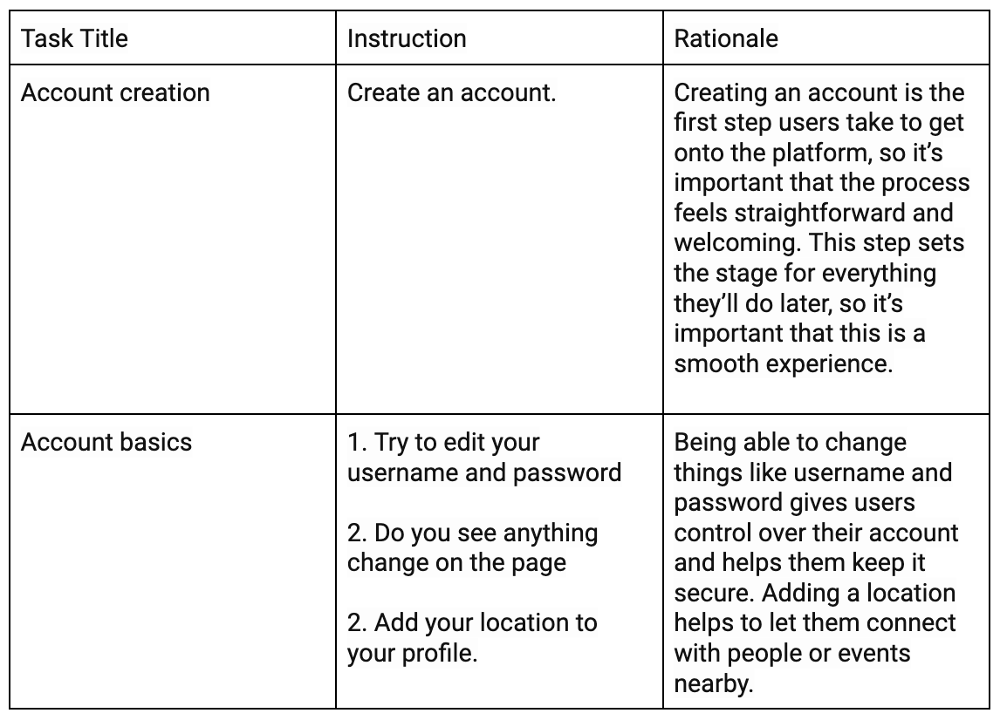
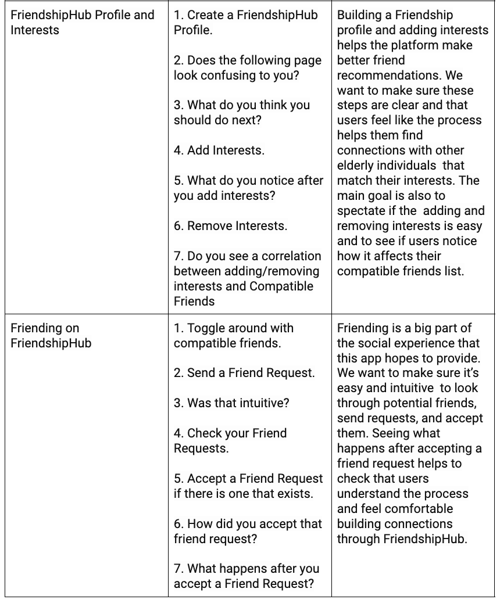
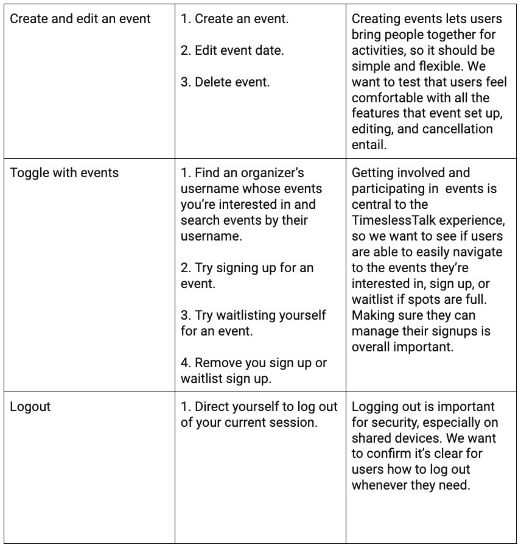

# TASK LIST:

{:width='500'}
{:width='500'}
{:width='500'}

# INTERVIEW REPORTS:

## 1. Yemei Zhu

### Report
Yemei was one of my target audiences and main stakeholders for this app, so having her test it out was a full-circle moment. I feel the overall test with Yemei went pretty well. Yemei is an 81-year-old living in the Bay Area who finds several social media apps overwhelming or difficult to use on her own. Upon creating her profile, she appreciated being directed to the next logical step/page without having to search for where to go next. Similarly, upon creating her FriendshipHub profile, she was redirected to a page that cohesively displayed all the FriendshipHub features.

Initially, she paused for a while as she was confused about the page, but once I informed her of the instructions button at the top right corner of every page, she was able to utilize it. I noticed that Yemei often toggled the instructions button multiple times while using a single feature. This demonstrated that having instructions available on every page is very helpful for users who may have a hard time remembering or fully becoming familiar with the app.

During the process of adding interests on FriendshipHub, Yemei noted that the italicized words were often hard to read and a bit small, suggesting that the font should be changed to be more readable, and that the overall text size of the app could be increased. We also had a discussion after she seemed to hesitate about what types of input to put in certain locations. She pointed out that it could be helpful to directly display certain prompts or examples of how input should look. She felt that FriendshipHub was a feature she had never experienced before in an app, and it was fun to explore the page and make new friends.

After diving into the Events feature, Yemei said she felt a great sense of community and belonging when she saw so many possible events she could attend. Upon creating an event, we realized that if she no longer wanted to host the event and attempted to delete it, the creator names would be mismatched until the page was revisited. At this point, although Yemei would often seek help from the instructions button, she was able to navigate through the app without much verbal prompting from me.

### Positive feedback: 
- Easy to sign up and get started.
- Very direct and understandable steps.
- After signing in or profile creation, user is immediately redirected to the next action step.
- FriendshipHub seems to be a new and interesting to form a bond with other elders. 
- Instructions helped a lot to ease confusions and allowed her to navigate the website with very minimal prompting.

### Negative feedback:
- Logout button could be made more visible/placed in a more visible location
- Instructions button “i” could be changed to “help” or “instructions” for users to more easily understand exactly what it does. 
- Font size could be increased to help users even more with readability nd cursive fonts used in the subheadings could either be made bigger or changed to a more readable font. 

### Observed Flaws:
- Differences in casing for words entered in Add Interest led certain Compatible Friends to be missed even if the word itself was the same outside of capitalization.
- After deleting an event, event creator usernames are mismatched/offset from their corresponding events until the page is reloaded.

## 2. Christopher Chen

### Report
I believe the overall test with Christopher was successful. Since Christopher is a college student, I initially asked him to create an account with his real age and then asked him to create an account with an age >65 just so he could test out the FriendshipHub feature. He is very tech savvy and is able to navigate the app without much prompting at all. 

Upon creating his profile, Christopher commented on the overall calming and welcoming feeling the colors and formatting provided to his user experience. It was obvious that oftentimes he would skip through the notes throughout the pages and automatically assume the functionalities of certain features and sections. 

After moving on to FriendshipHub, he found it easy to navigate the page with some help from the instructions button at the top right of the page. He toggled between that and without that a few times before being very seamless in his feature usage. As he was adding interests, we noticed that casing mattered for the interest words that were spelled the same. After thinking about it, it seems that it is important to specify both that an interest should be a singular word as well as to ensure difference in capitalization are treated as equal. He found the friending feature to be easy to maneuver and enjoyable. 

Moving on to event creation, he was able to quickly create an event, maybe a bit too quickly such that he accidentally entered  location instead of a number for the Event Spots section in Create Event. This led us to discover a discuss an interesting  issue, since he couldn’t edit the number of available spots in his event, there was no way of changing the value of Event spots to its appropriate value. He had to delete the event and recreate it. This restriction interrupted the natural flow he expected in managing event details, as he had anticipated more flexibility in modifying the information. We discussed that it’s important to create more specifically named and detailed locations for information to be entered as well as to provide more room for user mistakes. 

### Positive feedback:
- Warm and inviting interface
- Easy to navigate buttons and headings
- Great color scheme, very visually engaging
- Decently readable, all font colors and font sizes were chosen relatively appropriately.
- Instructions allow users to refresh their understanding of the page functionalities.

### Suggestions for improvement:
- Display short/concise examples for each section of a page for quick user understanding of potential inputs.
- Found some cursive fonts smaller and hard to read.
- Ability to add images to messaging feature between friends in FriendshipHub as currently only plain text is allowed. 
- Allow casing to be ignored upon interest entry in Add Interest.

### User Encountered Issues:
- Reloading web pages causes a 404 error.
- After entering the wrong information for Event Spots, the user was unable to change that value and instead had to delete event.

##
# FLAWS/OPPORTUNITIES FOR IMPROVEMENT

### Physical: Visible Logout Button (minor):
- Placing the logout button in a more visible location.
- <b> Current</b>: The logout button is currently found in the Settings feature, where users have to navigate to access it.
- <b> Future Design</b>: The logout button could potentially be placed in the same row as Home, Profile, Events, etc., for quick access.

### Linguistic: Instructions Button (i to “help”) (minor):
- Change the instructions “i” button to a “help”/”instructions” button for easier understanding of its use.
- <b> Current</b>: The instructions button on each page is labeled with an “i,” and user testing suggests that “i” may not be the most intuitive symbol for seeking help.
- <b> Future Design</b>: It could be helpful to change the label to a more descriptive word for clarity of the function that button serves.

### Physical: Increase Text Size/Font Readability (minor):
Increase the text size of the overall app to further aid readability.
- <b> Current</b>: The current overall font sizes of the Baskerville font are relatively readable. The issue mostly lies in the cursive font used for subheadings, which has proved to be less readable/noticeable.
- <b> Future Design</b>: Change the cursive font to a non-cursive font and increase the sizes of these subheadings.

### Conceptual: Intuitive Interest Deletion (minor):
- Make deleting an interest more intuitive for the user.
- <b> Current</b>: The current way to delete an interest in FriendshipHub is by manually entering the interest and clicking a button to delete it.
- <b> Future Design</b>: Change the code so that, instead of manually inputting the interest word again, each interest already has an “X” next to it that users can click to remove the interest.

### Conceptual: Allowing Interest Casing to Be Ignored (moderate):
- Allow casing to be ignored upon interest entry in Add Interest.
- <b> Current</b>: The current way of finding Compatible Friends for a user is by exactly matching their interests. For example, “hiking” will match with “hiking,” but “Hiking” and “hiKing” won’t count as matches.
- <b> Future Design</b>: Ensure the code ignores casing in interest matching by either ignoring case or converting all interest characters to a standard uppercase or lowercase format before comparing.

### Flaw Conceptual & Physical: Deleting Event Leads to Username/Event Mismatch (major):
- After a user deletes an event they created, the event creator usernames are mismatched/offset from their corresponding events until the page is reloaded.
- <b> Current</b>: When a user deletes an event they created, the page updates with mismatched/shifted usernames for the events. The event authors are not properly displayed and are offset by one immediately after deletion. If the user navigates away from the Events feature and returns, the events are displayed with the correct corresponding authors.
- <b> Future Design</b>: After deleting an event, the events and authors fields are handled separately. The current code only emits a reload of events instead of both events and authors simultaneously. This should be fixed in the code to accommodate the deletion so the page displays the correct information immediately.

### Flaw Conceptual & Physical: Reloading Web Pages Causes a 404 Error (critical):
- Ensure that users can reload the web page successfully and preserve page contents.
- <b> Current</b>: Currently, when the user tries to refresh the page they are viewing, a 404 error appears.
- <b> Future Design</b>: This likely occurs because the server does not recognize the route. The issue can be fixed by ensuring the server-side route handling and client-side route handling are aligned.