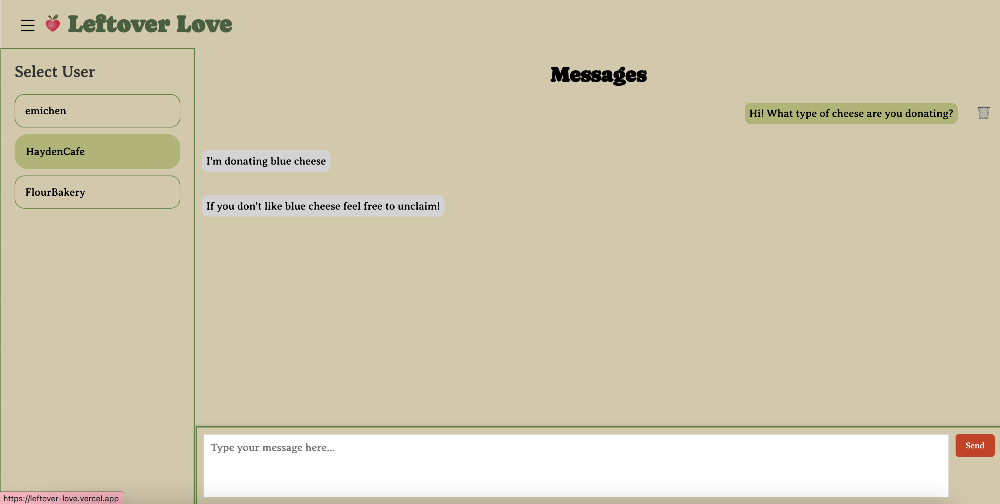
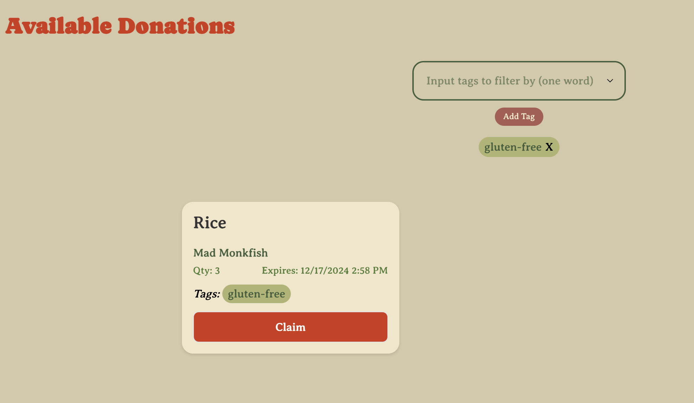
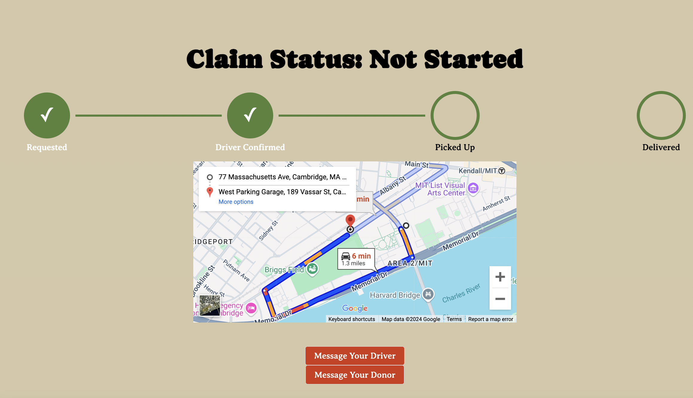
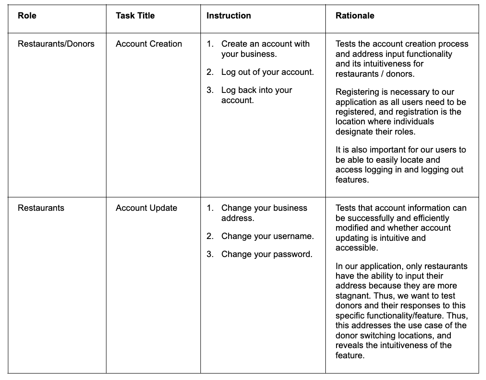
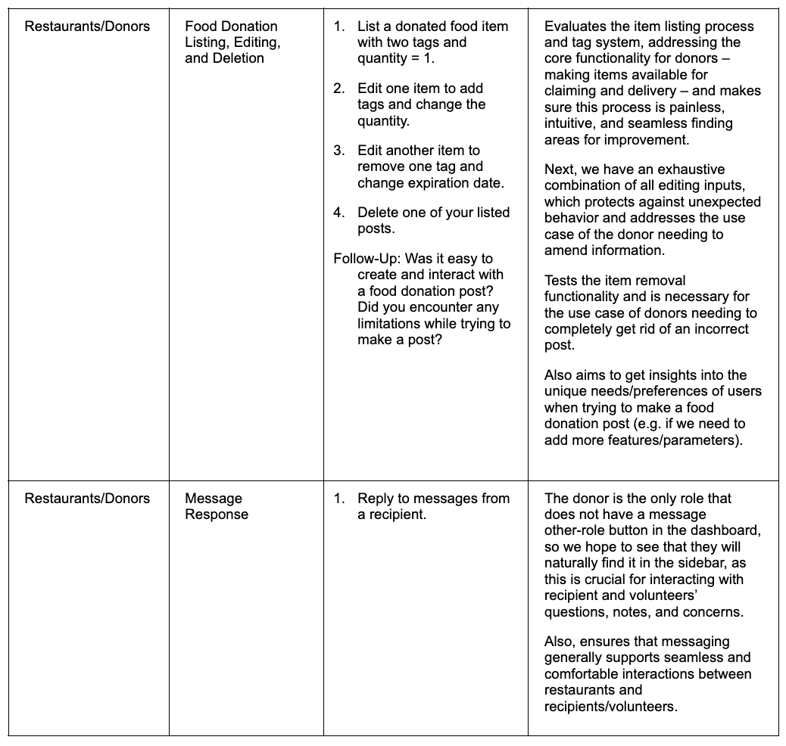
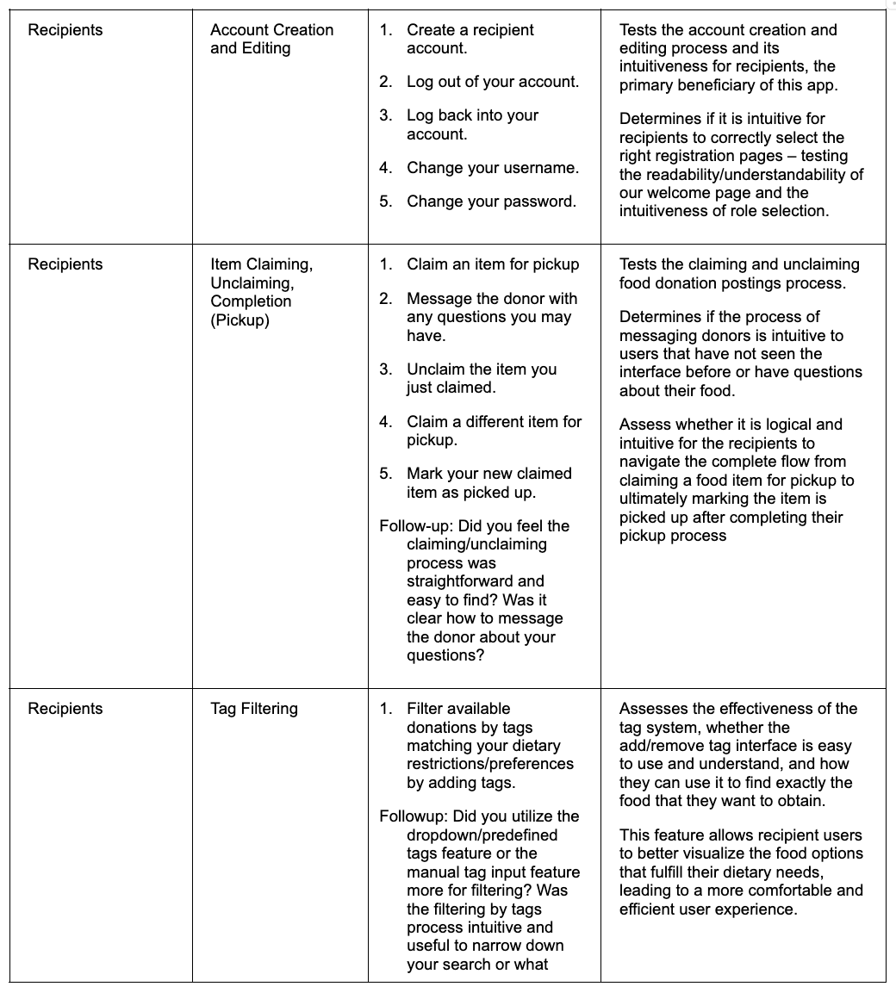
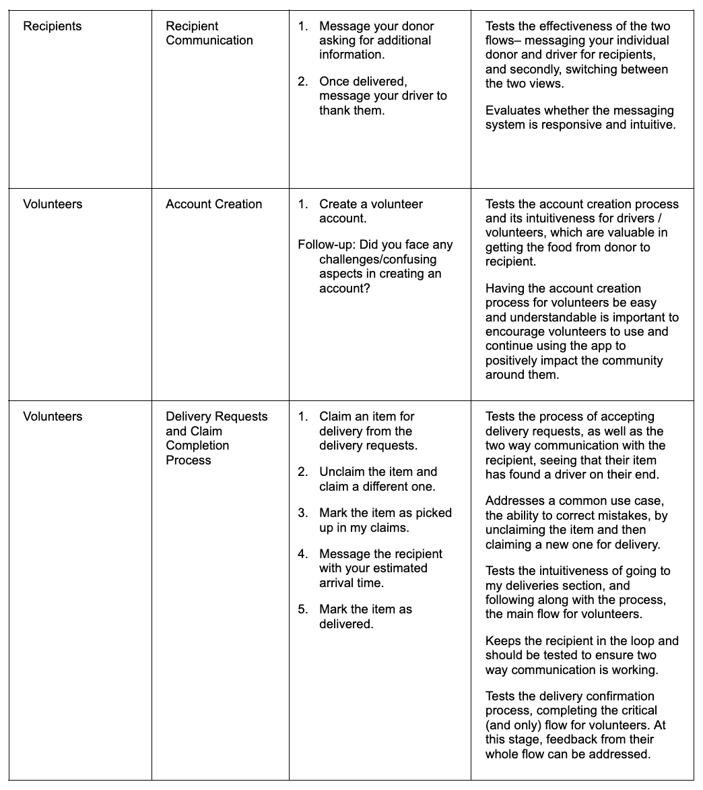

# Project 5: Beta Release


## Code Implementation


Github Repo:
https://github.com/emilymchen/leftover-love


## Deployed Site


Deployed Site: https://leftover-love.vercel.app/welcome


## Design Revisions
### Change I: Limits on Quantity of Food in Food Posting
__Updated Design:__
Previously, the `quantity` parameter in Posting was unrestricted. While we retained `quantity` as a state parameter, we implemented a cap of 5 for its maximum value, preventing users from inputting a number greater than 5 for `quantity.`During the design process, we faced two primary options: (1) cap the `quantity` value or (2) allow users to specify any number, with the option for recipients to claim subsets of the total quantity (e.g., multiple people claiming portions of a single post).


__Reasoning:__
We chose the first option for two key reasons:


- Implementation simplicity: Capping the value to 5 was more feasible within our project timeline, avoiding the complexity of managing multiple claims per post.


- Focus on small-scale restaurants/donors: We decided to shift our focus/target audience to smaller restaurants, which, as revealed through interviews, face fewer legal challenges than larger corporations and typically deal with smaller portions. Because they face fewer legal challenges, they are also more likely to engage with the application compared to larger established corporations.


While this limitation narrows the potential scale of individual donations, it strengthens the case for our app’s focus on serving small businesses and promoting sustainability at a community level.


### Change II: Adding Instructions as a State for Claiming
__Updated Design:__
In our initial design, we did not include `instructions` as a state for claiming. However, we have now added this feature, allowing recipients to provide specific instructions (e.g., "leave it at the door") when requesting a delivery.


__Reasoning:__
During development, we recognized that including an `instructions` parameter would enhance user experience by offering recipients greater flexibility and clarity in specifying delivery preferences. This feature aligns with the functionality of similar applications, such as DoorDash, which improves familiarity and usability for users.


### Change III: Removal of `delivery_time` as a State for Delivering
__Updated Design:__
In our initial design, `delivery_time` was included as a state for Delivering. However, we removed it during implementation due to practical and usability considerations. The app now relies solely on the inherent `expiration_time` associated with each food donation.


__Reasoning:__
We identified several issues with including `delivery_time`:
- Redundant information: Each donation already has an expiration time, making a separate `delivery_time` parameter unnecessary and adding unnecessary complexity to the interface. We also have a messaging feature, which makes it easier for the volunteer and recipient to communicate and agree on an established delivery time. 


- Deciding who determines the delivery_time poses significant challenges. Assigning this responsibility to restaurants is impractical since their involvement ends after food pickup. Similarly, requiring recipients to set delivery times could lead to unrealistic expectations and scheduling conflicts for volunteers.


- Volunteer experience: Allowing recipients to specify arbitrary or inconvenient delivery times could deter volunteers from participating, undermining their critical role in the app's success.


This modification simplifies the app’s design, reduces cognitive load for users, and ensures the process remains practical for all those who use the app.


### Change IV: Adding Preset Tags to Select On Top of Self Defined Tags for Filtering
__Updated Design:__
In our initial design, we did not include a series of the most common preset tags for recipient users to select from to filter their available donations. We have now added this preset tags feature as an add on to the previously established self defined tags.


__Reasoning:__
In the feedback we received from the previous assignment, we realized that adding another easy and efficient way for recipient users to add tags for filtering would greatly improve the user experience. This offers users greater sense of flexibility and increases efficiency, allowing users to directly select from a list of commonly appearing tags.


### Change V: Removing Image Upload for Food Postings
__Updated Design:__
In our initial design, we had food donors upload an image while posting food, which would then be displayed in the feed along with other details about a food listing. We have removed image uploading, so instead, the food name and details are the only things displayed in the feed.


__Reasoning:__
We wanted to reduce the amount of friction for donors to list food as much as possible, and for restaurants who may be listing tens of plates of food, having to take pictures for each of these items would be tedious and time-consuming. Additionally, it allows us to display more useful information such as the food’s tags and expiration time in a more compact manner.


## Prepopulated Realistic Data
## 1. Prepopulate Data


Link To Website: https://leftover-love.vercel.app/welcome


To prepopulate the website, we created a number of real potential users. For each of the users, we enabled a number of different features, ranging from creating conversations between a couple of users, creating food donations, claiming food donations, and creating delivery requests.


You can log into the following accounts:
Restaurant Role
```
username: FlourBakery


password: password
```


Volunteer Role
```
username: emichen


password: password
```


Recipient Role
```
username: sabrinado


password: password
```
to see one of the example profiles!


We also have a couple of other false accounts besides these listed sample accounts (e.g. HaydenCafe, TeaDo, Mad Monkfish). I have populated the app with real messages to the accounts, food donations posts, food request claims, and food deliveries.


__Sample Conversation:__



__Food Donation Posts:__


(Filtered Posts)



__Food Claims:__


(Completed Claims)


(Pending Claims)


__Food Deliveries:__


(Order Tracker)



(Delivery Requests)


(My Deliveries )


## Task List




